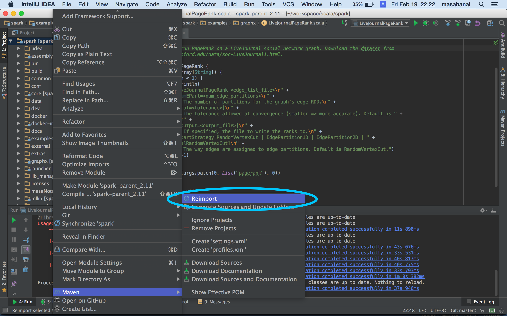
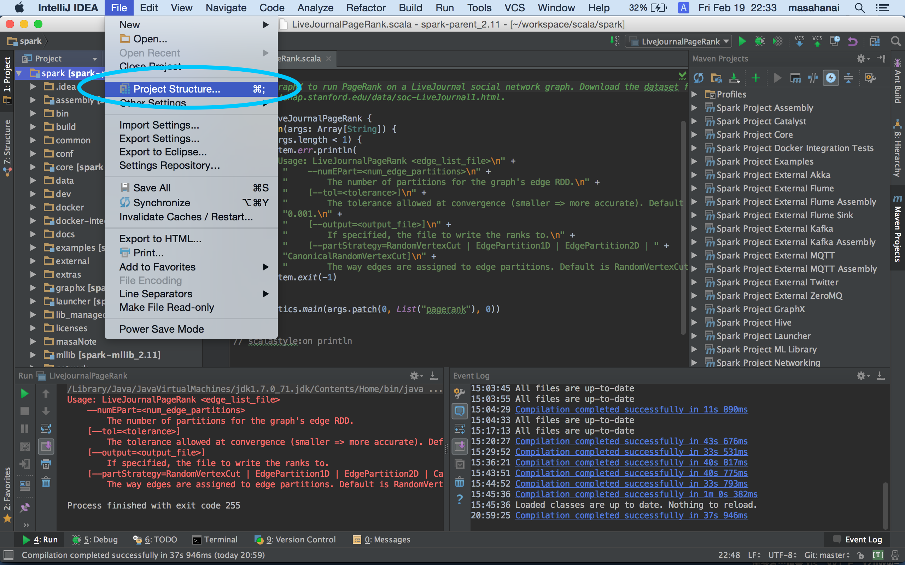
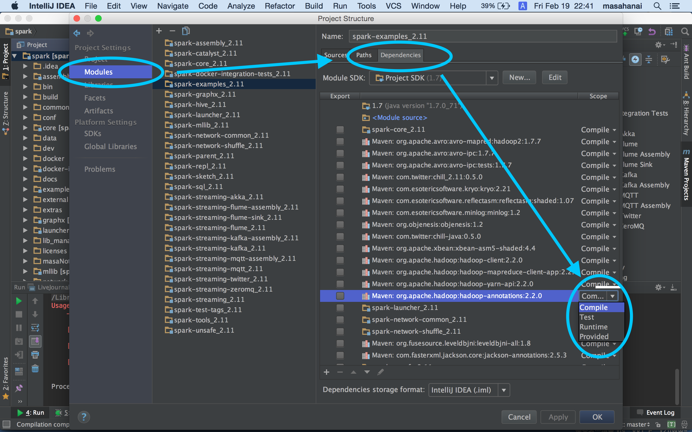
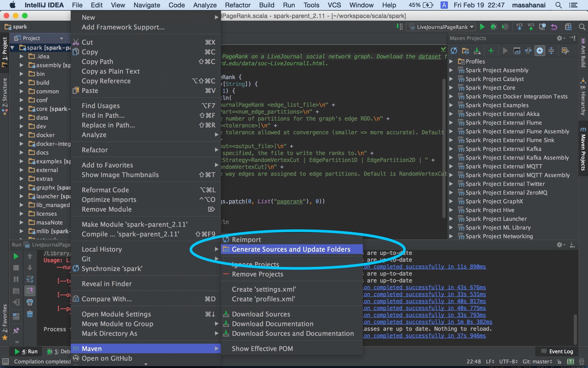
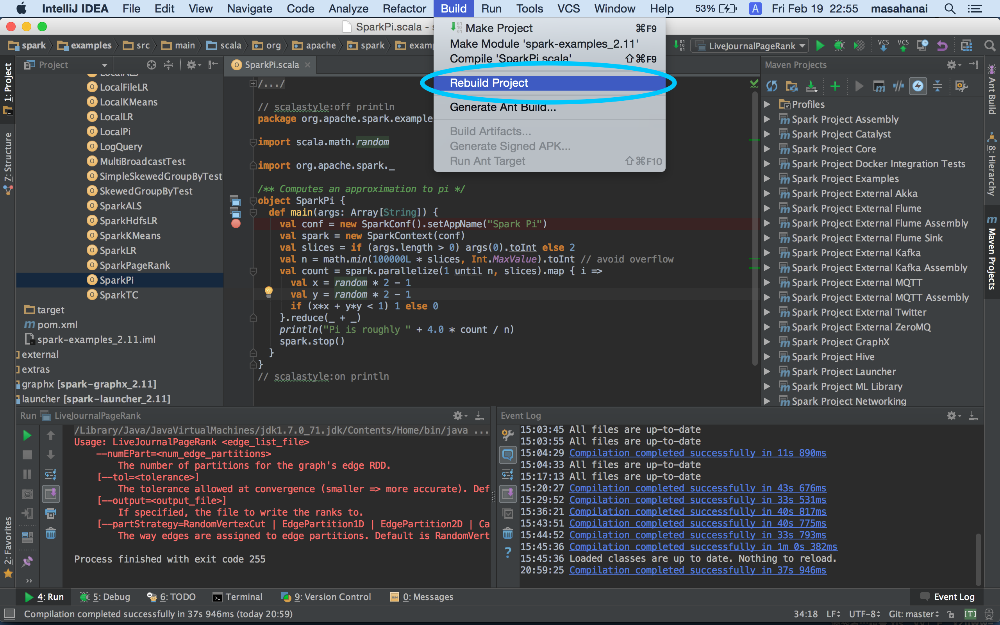
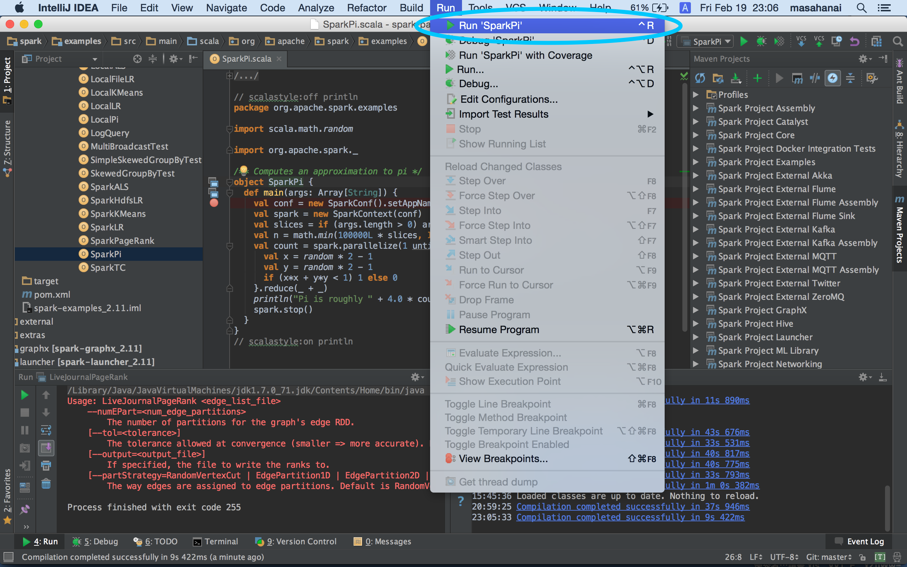

# Spark on IntelliJ

This document provides how to set up IntelliJ developing environment for Spark (compile & debug).

## Overview
1. Install `Java` `Scala` `Git` `Maven` `IntelliJ (with Scala plug-in)`
2. Download source code from github https://github.com/apache/spark
3. Import Spark Project to IntelliJ
4. Set up scope of dependencies from **provided** to **compile**
5. Generate Source Code (Avro)
6. Compile & Debug in IntelliJ

## Reference
1. http://spark.apache.org/docs/latest/
2. http://spark.apache.org/docs/latest/building-spark.html#building-spark-with-intellij-idea-or-eclipse
3. https://cwiki.apache.org/confluence/display/SPARK/Useful+Developer+Tools#UsefulDeveloperTools-IDESetup
4. http://apache-spark-developers-list.1001551.n3.nabble.com/IntelliJ-Runtime-error-td11383.html

## Environment
- `OS` Mac OS X 10.10.5
- `Spark` 2.11
- `IntelliJ` ver 15 (with Scala plug-in)
- `Scala` 2.11
- `Java` 1.7
- `Maven` 3.3.3
- `Git` 2.5.4

## 1. Install `Java` `Scala` `Git` `Maven` `IntelliJ (with Scala plug-in)`  

## 2. Download source code from github
From github, you can get the latest version of Spark.

```
$ git clone git@github.com:apache/spark.git
```

## 3. Import Spark Maven Project to IntelliJ
Spark projects are basically managed by Maven, so it needs to be imported as Maven Project.

Choose `File` > `Import` and select downloaded project. If the project is already opened, `Maven` > `Reimport` the project.




## 4. Set up scope of dependencies from **provided** to **compile**
Basically in IntelliJ, all dependent files needs to be **compiled** from source code. If the scope is **provided**, the files are provided as .jar files. 

Choose `File` > `Project Structure`



And then, choose `Modules` > *Modules which need to compile* > `Dependencies` > `Scope` (You should change all dependencies from `Provided` to `Compile` )




## 5. Generate Source Code using Maven
Spark uses source code generator in object serializer, so generation of such code is required in IntelliJ.

Choose `Maven` > `Generate Sources and Update Folders`



## 6. Compile & Debug
`Build` > `Rebuild Project` (it takes long time to build all projects)



After building the project, choose any .scala file which includes `main()` function and then compile it.
After compiling, run or debug.



Created By Masa (Feb. 19 2016)
